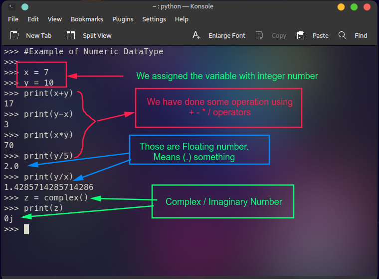

# Learn Python Basic to Advanced

This is a python learner's repo.You can learn python from basic to advanced by following my notes and explaination. Also included  Sekh-Rasel IT Lab TOT class assignments.

## Getting Started

1. Clone the repository:

```
git clone https://github.com/arrahmanbd/python_master_guide
```

2. Based on Python 3.15.


## What's included!

This Repo includes the following features:

- **Basic Python:** Learn the basic of python programming language, var, list, tuples history etc.

- **Shekh-Rasel Trainer:** Included all of Sekh-Rasel IT Lab Python Training Curriculum.Read the PDF.

- **Advanced Concept:** OOP,Class in python and other advanced level practice included.

- **Database Management:** Includes SQLite database management with assignment and explainantion.

- **Notes for Students:** I have also added notes and explainations .
## Examples


<br>




## Contributing

Contributions are welcome! If you find a bug or have a feature request (working on QT6), please open an issue or submit a pull request.

## 🔗 Follow
[](https://arrahmanbd.github.io/)
[](https://www.linkedin.com/in/arrahmanbd)
[](https://www.github.com/arrahmanbd)

## License

This project is licensed under the MIT License - see the [LICENSE](LICENSE) file for details.